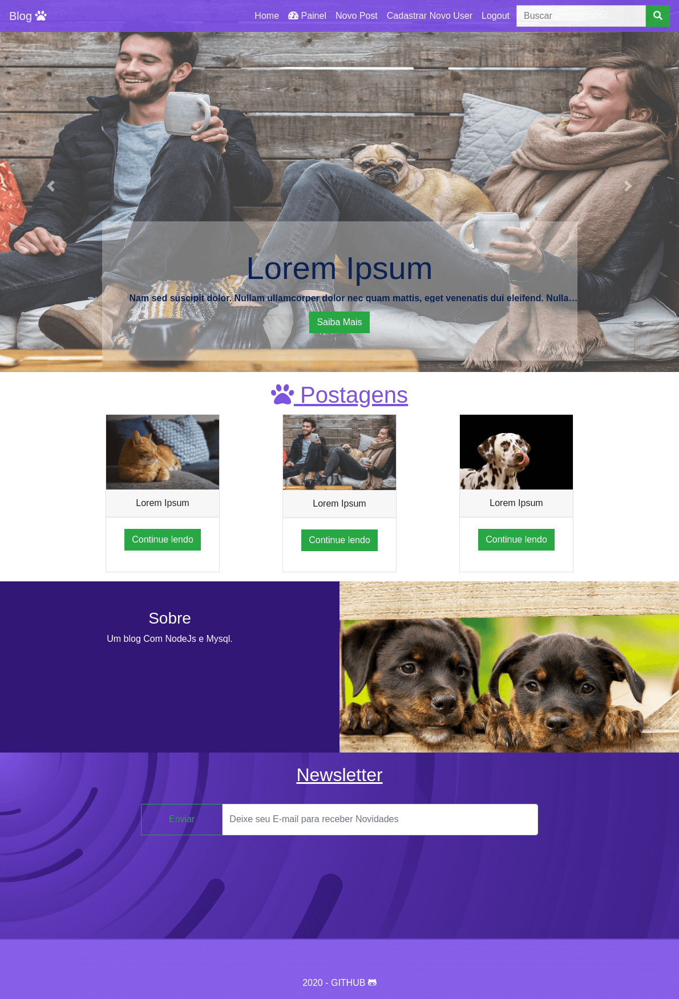

# Blog básico com nodeJs, mysql e handlebars

### :rocket: Instalação Local
Pré-requisitos

- NodeJs versão 8 ou superior;
- Banco de dados Mysql;

### Instalação
1. Faça login no mysql e crie uma base de dados com o nome 'blog';
2. Faça o clone do repositório e navegue até a pasta 'infra';
3. Edite o arquivo Mysql.js com os dados da sua conexão Mysql;
4. Vá até pasta raiz do projeto abra o terminal e digite:  ` npm isntall`;
5. Depois digite `npm start`;
6. Agora o blog poderá ser acessado no endereço: http://localhost:4000/
para acessar o Painel utilize: Login: admin e Senha: admin
